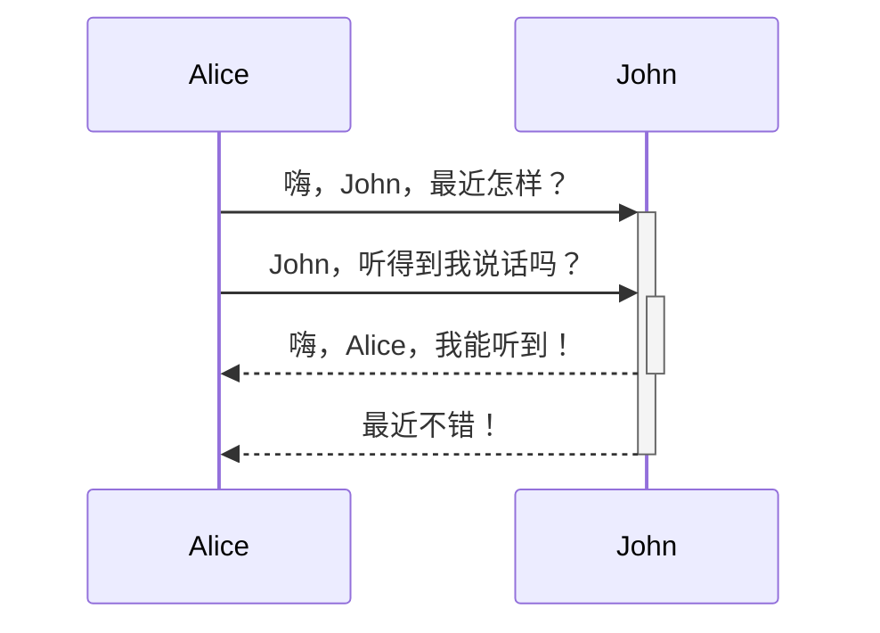

123
![[微信图片.jpg|90]]

[123](微信图片.jpg)
$$\begin{vmatrix}a & b\\ c & d \end{vmatrix}=ad-bc$$


%%123%%


|123|123|123|
|:-:|:-:|:-:|
|132|123|123|
|132|123|123|
|132|123|123|

```c++
#include <isotream>
int main()
{
	std::cout << "Hello World" << std::endl;
}
```

- [ ] 1312